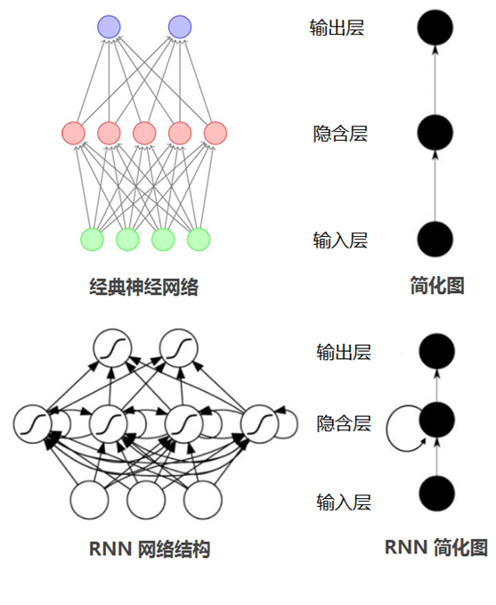

# NLP网络

一般深度学习网络如：DNN或者CNN，输入的数据的维度是相同的，而且数据之间也是独立的，每层神经元都直接向下传递，
每个样本之间在各个时刻是独立的。
但是在自然语言处理中，所需要处理得数据都与时间序列相关，且输入的序列的数据长度不是固定的。

## RNN 循环神经网络

Recurrent Neural Networks，神经元的输出可以作为下一个时间戳作用到自身上。
可以看对比图

从RNN的简化图中可以不难的看出多出的一个隐含层，这个隐含层正是代表着神经元的输出在下一个
时间戳还会返回来作为输入的一部分。
你

### 问题
1. 上下文的信息可以通过隐含层作用在后续的节点
2. 没办法解决信息路径长的依赖，会出现梯度爆炸或者梯度消失得情况，如下图

3. 无法并行计算

#### 解决办法
1. 流程
    1. 定点裁剪
        
        固定time step，对梯度进行裁剪，但是造成没法捕捉远距离的信息。
    
    2. 梯度裁剪
        
        固定得阈值，当梯度达到某个值后，进行控制，按照某个固定值进行传播。
    
2. 网络结构

    1. LSTM
    2. GRU
    3. Attention 